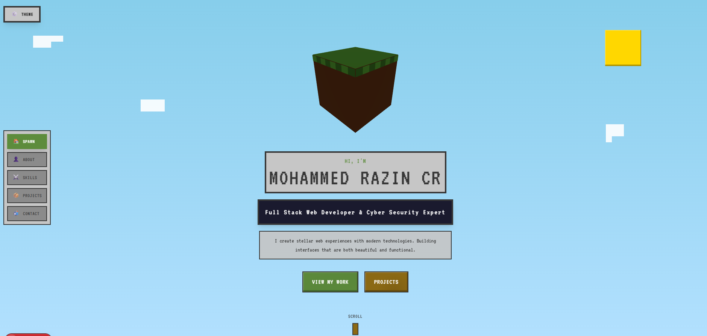

<div align="center">

# ⚔️ 𝗠𝗜𝗡𝗘𝗖𝗥𝗔𝗙𝗧 𝗣𝗢𝗥𝗧𝗙𝗢𝗟𝗜𝗢 🛡️
### 𝘯𝘦𝘹𝘵-𝘨𝘦𝘯 𝘨𝘢𝘮𝘪𝘧𝘪𝘦𝘥 𝘦𝘹𝘱𝘦𝘳𝘪𝘦𝘯𝘤𝘦

[](https://mohammed-razin-cr.tech)
[](https://nextjs.org/)
[](https://tailwindcss.com/)
[](https://www.mongodb.com/)
[](https://www.typescriptlang.org/)

</div>

---

## 🌌 𝗢𝗩𝗘𝗥𝗩𝗜𝗘𝗪

I constructed this immersive **Minecraft-themed portfolio** using **Next.js** and **Tailwind CSS**, featuring dynamic biomes, **3D animations**, and a real-time **Day/Night cycle** to showcase my work.

I engineered a gamified experience featuring a hidden **block-breaking mini-game**, unlockable **achievements**, and an **inventory-style skills section** that makes exploring my projects engaging. Also integrated a full-stack **MongoDB contact system**, authentic **sound effects**, and optimized it for a seamless **mobile experience**.

---

## ⚡ 𝗞𝗘𝗬 𝗙𝗘𝗔𝗧𝗨𝗥𝗘𝗦

### 🗺️ **Dynamic World System**
- **Biome Switching**: Seamlessly toggle between **Plains**, **Desert**, **Snow**, and **Jungle** environments.
- **Time Cycle**: Real-time **Day/Night** toggle affecting lighting, sky gradients, and celestial bodies.
- **Weather System**: Reacts to biomes (e.g., Snowfall in Snow biome).

### 🎮 **Gamification**
- **Inventory UI**: Skills displayed as Minecraft items with classic tooltips.
- **Mini-Game**: A hidden **Block Breaker** game where you mine for diamonds.
- **Achievements**: Unlock alerts for exploring, clicking, and finding secrets.
- **Easter Eggs**: Try the **Konami Code** (`↑ ↑ ↓ ↓ ← → ← → B A`) for a surprise!

### ⚙️ **Core Tech**
- **Full Stack Contact Form**: Messages are saved directly to **MongoDB**.
- **Sound Engine**: Authentic Minecraft SFX for clicks, interactions, and success events.
- **Responsive Design**: Mobile-first architecture with custom touch controls.

---

## 🛠️ 𝗧𝗘𝗖𝗛 𝗦𝗧𝗔𝗖𝗞

| Category | Technologies |
|----------|--------------|
| **Frontend** | Next.js 14, React, Tailwind CSS, Framer Motion |
| **Backend** | Next.js API Routes, Mongoose |
| **Database** | MongoDB Atlas |
| **Language** | TypeScript |
| **Assets** | Custom CSS 3D Blocks, Pixel Art SVG |

---

## 🚀 𝗚𝗘𝗧𝗧𝗜𝗡𝗚 𝗦𝗧𝗔𝗥𝗧𝗘𝗗

Clone the project and enter the dimension:

```bash
git clone https://github.com/Mohammed-razin-cr/Minecraft-Portfolio.git
cd Minecraft-Portfolio
```

Install the dependencies:

```bash
npm install
# or
pnpm install
```

### 🔐 Environment Setup

Create a `.env.local` file in the root directory and add your MongoDB connection string:

```env
MONGODB_URI=your_mongodb_connection_string_here
```

Run the development server:

```bash
npm run dev
```

Open [http://localhost:3000](http://localhost:3000) to start exploring!

---

## 📦 𝗕𝗨𝗜𝗟𝗗 & 𝗗𝗘𝗣𝗟𝗢𝗬

To create a production build:

```bash
npm run build
```

**Recommended Hosting:**
- **DigitalOcean App Platform** (Connected via GitHub)
- **Vercel** (Zero config)

---

<div align="center">

Built with 🟥 + 🟦 by **Mohammed Razin CR**

</div>
